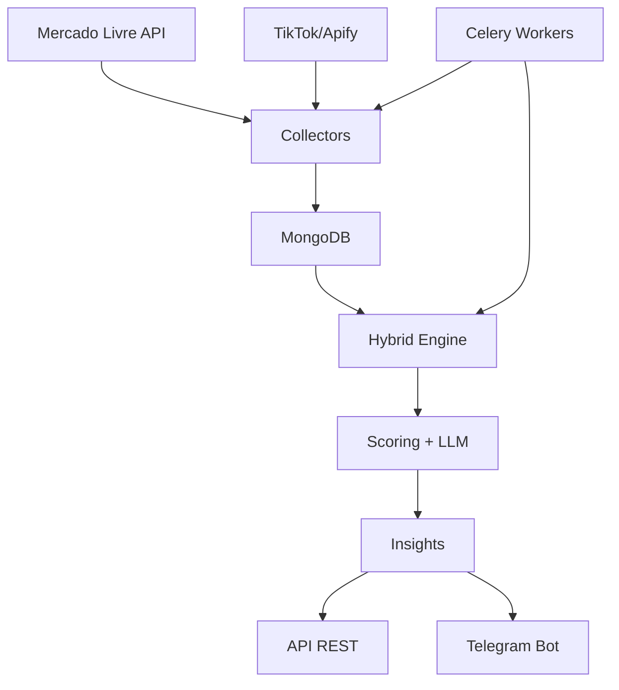

# 🚀 Trends Intelligence Engine

> **Motor híbrido de análise de tendências** que combina dados de marketplace e redes sociais com algoritmos de scoring matemático e inteligência artificial para identificar produtos e conteúdos virais em tempo real.

## 📋 Visão Geral

O **Trends Intelligence Engine** é uma plataforma completa de análise preditiva que monitora continuamente:

- 🛒 **Marketplace**: Produtos em destaque no Mercado Livre
- 📱 **Social Media**: Tendências e hashtags no TikTok  
- 📊 **Analytics**: Scoring híbrido (matemático + LLM)
- 🔔 **Alertas**: Notificações em tempo real via Telegram
- 📈 **Rankings**: APIs para consulta de insights de tendências

### 🎯 Objetivo

Detectar produtos e conteúdos com potencial viral **antes** que se tornem mainstream, combinando:

1. **Análise Quantitativa**: Métricas de vendas, views, engagement
2. **Análise Qualitativa**: Classificação contextual via LLM
3. **Análise Temporal**: Velocidade de crescimento e momentum

---

## 🏗️ Arquitetura

### 🎛️ Visão de Alto Nível



### 🧱 Componentes Principais

| **Camada** | **Componente** | **Responsabilidade** |
|------------|----------------|---------------------|
| **API** | FastAPI | Interface REST para consultas |
| **Workers** | Celery | Processamento assíncrono |
| **Engine** | HybridTrendEngine | Scoring híbrido (numérico + LLM) |
| **Collectors** | ML/TikTok | Coleta de dados externos |
| **Storage** | MongoDB | Persistência de dados |
| **Broker** | Redis | Fila de mensagens |
| **AI** | OpenAI Compatible | Análise contextual |
| **Alerts** | Telegram Bot | Notificações em tempo real |

### 📁 Estrutura Clean Architecture

```
📂 bot-trends/
├── 🎯 apps/                    # Pontos de entrada
│   ├── api/                   # API REST (FastAPI)
│   ├── worker/                # Processamento assíncrono (Celery)
│   ├── migrate/               # Sistema de migrações
│   └── bootstrap/             # Configuração inicial
├── 🧠 src/                    # Core do sistema
│   ├── domain/                # Modelos e regras de negócio
│   │   ├── trend_models.py    # Entidades de tendência
│   │   ├── scoring.py         # Algoritmos de scoring
│   │   └── interfaces.py      # Contratos/interfaces
│   ├── application/           # Casos de uso
│   │   ├── trend_engine.py    # Motor principal de análise
│   │   └── prompt_builder.py  # Construção de prompts LLM
│   └── infrastructure/        # Implementações técnicas
│       ├── collectors/        # Coleta de dados externos
│       ├── db/               # Persistência MongoDB
│       ├── llm/              # Cliente LLM
│       └── telegram/         # Notificações
└── 🧪 tests/                 # Testes automatizados
```

---

## 🚀 Configuração e Execução

### 🐳 Execução com Docker

#### 1️⃣ **Configurar variáveis de ambiente**

Crie um arquivo `.env`:

```bash
# Banco de dados
MONGO_URI=mongodb://mongo:27017
MONGO_DB=trends

# Fila de mensagens
REDIS_URL=redis://redis:6379/0

# LLM (OpenAI ou compatível)
LLM_BASE_URL=https://api.openai.com/v1
LLM_API_KEY=sk-xxx...
LLM_MODEL=gpt-4o-mini

# Telegram (opcional)
TELEGRAM_BOT_TOKEN=xxx:xxx
TELEGRAM_CHAT_ID=123456789

# APIs externas
APIFY_TOKEN=xxx  # Para coleta TikTok
ML_SITE_ID=MLB   # Mercado Livre Brasil
```

#### 2️⃣ **Subir a infraestrutura**

```bash
# Subir todos os serviços
docker compose up --build

# Ou em background
docker compose up -d --build
```

#### 3️⃣ **Executar migrações iniciais**

```bash
# Criar indexes e collections
docker compose run --rm api python -m apps.migrate.main
```

#### 4️⃣ **Bootstrap com dados iniciais**

```bash
# Categorias padrão
docker compose run --rm api python -m apps.bootstrap.main

# Ou buscar categorias reais do ML
BOOTSTRAP_FETCH_ML_CATEGORIES=true docker compose run --rm api python -m apps.bootstrap.main
```

#### 5️⃣ **Verificar saúde do sistema**

```bash
curl http://localhost:8000/health
```

### 🎛️ Endpoints da API

A API estará disponível em `http://localhost:8000` com documentação Swagger em `/docs`.

#### 🔍 **Monitoramento**

```bash
GET /health                    # Status geral
GET /health/migrations         # Status das migrações
```

#### 📊 **Rankings e Insights**

```bash
# Ranking de produtos por score
GET /rankings/latest?hours=72&limit=20&source=all

# Insight detalhado de um produto  
GET /products/{product_id}/insight/latest

# Histórico de métricas
GET /products/{product_id}/curve?hours=72

# Busca por termo
GET /search?q=smartphone&limit=10
```

#### 🏷️ **Categorias**

```bash
GET /categories                # Listar categorias
POST /categories/enable        # Ativar categoria
POST /categories/disable       # Desativar categoria
```

---

## 🧠 Motor de Análise Híbrido

### 📊 **Scoring Matemático** 

Algoritmo determinístico baseado em 6 dimensões:

```python
Score = (
    0.20 * rank_momentum +      # Melhora no ranking
    0.15 * reviews_velocity +   # Velocidade de reviews
    0.25 * social_velocity +    # Crescimento social
    0.15 * views_24h +          # Views últimas 24h  
    0.15 * engagement_24h +     # Engagement últimas 24h
    0.10 * price_stability      # Estabilidade de preço
) * 100
```

### 🤖 **Análise LLM**

Classificação contextual em 5 categorias:

- **ESTAVEL**: Produto consolidado, vendas consistentes
- **SUBINDO**: Crescimento gradual e sustentado  
- **VIRALIZANDO**: Explosão viral em curso
- **PICO_TEMPORARIO**: Pico sazonal/promocional
- **EM_QUEDA**: Tendência descendente

### 🔄 **Fórmula Final**

```python
final_score = 0.6 * numeric_score + 0.4 * llm_score
```

**Características:**
- ✅ Fallback automático se LLM falhar
- ✅ Pesos configuráveis
- ✅ Explicabilidade completa
- ✅ Processamento em tempo real

---

## ⚙️ Automação com Workers

### 📅 **Agendamento Automático**

O sistema Celery Beat executa tarefas periodicamente:

```python
# Configuração do scheduler
BEAT_SCHEDULE = {
    "collect-ml-every-6h": {      # Coleta Mercado Livre
        "task": "tasks.collect_ml",
        "schedule": 60 * 60 * 6,
    },
    "collect-tiktok-every-30m": { # Coleta TikTok
        "task": "tasks.collect_tiktok", 
        "schedule": 60 * 30,
    },
    "trend-analysis-every-30m": { # Análise de tendências
        "task": "tasks.hybrid_trend_analyze",
        "schedule": 60 * 30,
    },
}
```

### 🔧 **Gerenciamento de Workers**

```bash
# Escalar workers horizontalmente
docker compose up --scale worker=3

# Monitorar filas
docker compose exec worker celery -A apps.worker.main inspect active

# Logs em tempo real
docker compose logs -f worker
```

### 📊 **Filas Especializadas**

- **`ml`**: Coleta Mercado Livre
- **`tiktok`**: Coleta TikTok/social
- **`trend`**: Análise de tendências
- **`default`**: Tarefas gerais

---

## 📊 Modelo de Dados

### 🗄️ **Collections MongoDB**

#### **products** - Catálogo de produtos
```javascript
{
  "product_id": "uuid-v4",
  "title": "iPhone 15 Pro Max", 
  "category": "electronics",
  "canonical_id": "MLB123456", // ID original ML
  "uuid": "generated-uuid",    // UUID interno
  "sources": ["mercadolivre"],
  "created_at": "2024-01-01T10:00:00Z"
}
```

#### **metrics** - Métricas temporais
```javascript
{
  "product_id": "uuid-v4",
  "source": "mercadolivre",
  "ts": "2024-01-01T10:00:00Z",
  "price": 5999.99,
  "sold_quantity": 1250,
  "views_24h": 50000,
  "engagement_24h": 2500,
  "reviews_total": 450,
  "rank_position": 3
}
```

#### **trend_insights** - Resultados da análise
```javascript
{
  "product_id": "uuid-v4", 
  "ts": "2024-01-01T10:00:00Z",
  "window_from": "2024-01-01T00:00:00Z",
  "window_hours": 72,
  "sources": ["mercadolivre", "tiktok"],
  "numeric_score_0_100": 75.5,
  "llm_score_0_100": 82.0,
  "final_score_0_100": 78.3,
  "trend_classification": "VIRALIZANDO",
  "risk_level": "MEDIO",
  "analysis": "Produto com crescimento...",
  "recommendation": "Monitorar de perto..."
}
```

#### **categories** - Configuração de categorias
```javascript
{
  "category_id": "electronics",
  "name": "Eletrônicos",
  "enabled": true,
  "source_mapping": {
    "mercadolivre": "MLB1574"
  }
}
```

### 🔍 **Índices Estratégicos**

```javascript
// Otimização para consultas frequentes
db.products.createIndex({"product_id": 1})
db.metrics.createIndex({"product_id": 1, "ts": -1})
db.trend_insights.createIndex({"product_id": 1, "ts": -1})
db.trend_insights.createIndex({"final_score": -1, "ts": -1})
db.categories.createIndex({"category_id": 1})
```

---

## 🧪 Desenvolvimento e Testes

### 🏃‍♂️ **Execução Local**

```bash
# Instalar dependências
poetry install

# Ativar ambiente
poetry shell

# Rodar testes
pytest

# Com cobertura
pytest --cov=src --cov-report=html

# Lint e formatação
ruff check .
black .
```

### 📋 **Estrutura de Testes**

```
tests/
├── test_repos.py          # Testes de repositório
├── test_scoring.py        # Testes de algoritmos de scoring
└── test_trend_engine.py   # Testes do motor principal
```

### 🔍 **Debugging**

```bash
# Logs detalhados do worker
docker compose logs worker -f

# Entrar no container para debug
docker compose exec api bash

# Executar análise manual
docker compose run --rm api python -c "
from apps.worker.tasks_trend import hybrid_trend_analyze
hybrid_trend_analyze(hours=24, limit_products=5)
"
```

---

## 🔐 Segurança e Boas Práticas

### 🛡️ **Medidas de Segurança**

- ✅ **Credentials via environment**: Todas as credenciais via `.env`
- ✅ **Logs sanitizados**: Sem exposição de tokens/senhas
- ✅ **UUID internos**: Produtos identificados por UUID, não IDs externos
- ✅ **Rate limiting**: Controle de frequência nas APIs externas
- ✅ **Health checks**: Monitoramento contínuo da saúde dos serviços

### 🔄 **Migrações**

- ✅ **Idempotentes**: Podem ser executadas múltiplas vezes
- ✅ **Versionadas**: Controle de versão do schema
- ✅ **Lock distribuído**: Previne execução concorrente
- ✅ **Rollback seguro**: Possibilidade de reverter alterações

### 📊 **Monitoramento**

```bash
# Verificar saúde das migrações
curl http://localhost:8000/health/migrations

# Status dos workers
docker compose exec worker celery -A apps.worker.main inspect stats

# Métricas do MongoDB
docker compose exec mongo mongosh --eval "db.stats()"
```

---

## 🚀 Roadmap e Melhorias Futuras

### 🎯 **Próximas Implementations**

- [ ] **Dashboard Web**: Interface gráfica para análise visual
- [ ] **Cache Redis**: Otimização de ranking com cache  
- [ ] **Percentil por categoria**: Normalização por setor
- [ ] **Circuit breakers**: Resiliência para APIs externas
- [ ] **Observabilidade**: Métricas com Prometheus/Grafana

### 🌟 **Visão de Longo Prazo**

- [ ] **Multi-marketplace**: Shopee, Amazon, Magazine Luiza
- [ ] **ML Predictive**: Modelos estatísticos de predição
- [ ] **Auto-categorização**: Classificação automática via LLM
- [ ] **Detecção de nicho**: Identificação automática de mercados
- [ ] **Arbitragem**: Oportunidades entre marketplaces
- [ ] **API Premium**: Sistema de assinatura e limites

---

## 📞 Suporte e Contribuição

### 🐛 **Reportar Bugs**

1. Verificar logs: `docker compose logs`
2. Executar health checks: `curl http://localhost:8000/health`
3. Abrir issue com contexto completo

### 🤝 **Contribuições**

1. Fork do repositório
2. Criar branch feature: `git checkout -b feature/amazing-feature`
3. Commit changes: `git commit -m "Add amazing feature"`
4. Push to branch: `git push origin feature/amazing-feature`
5. Open Pull Request

### 📧 **Contato**

Para dúvidas técnicas ou parcerias, entre em contato através dos issues do repositório.

---

<div align="center">

**🚀 Trends Intelligence Engine** - *Detectando o futuro, hoje.*

</div>

