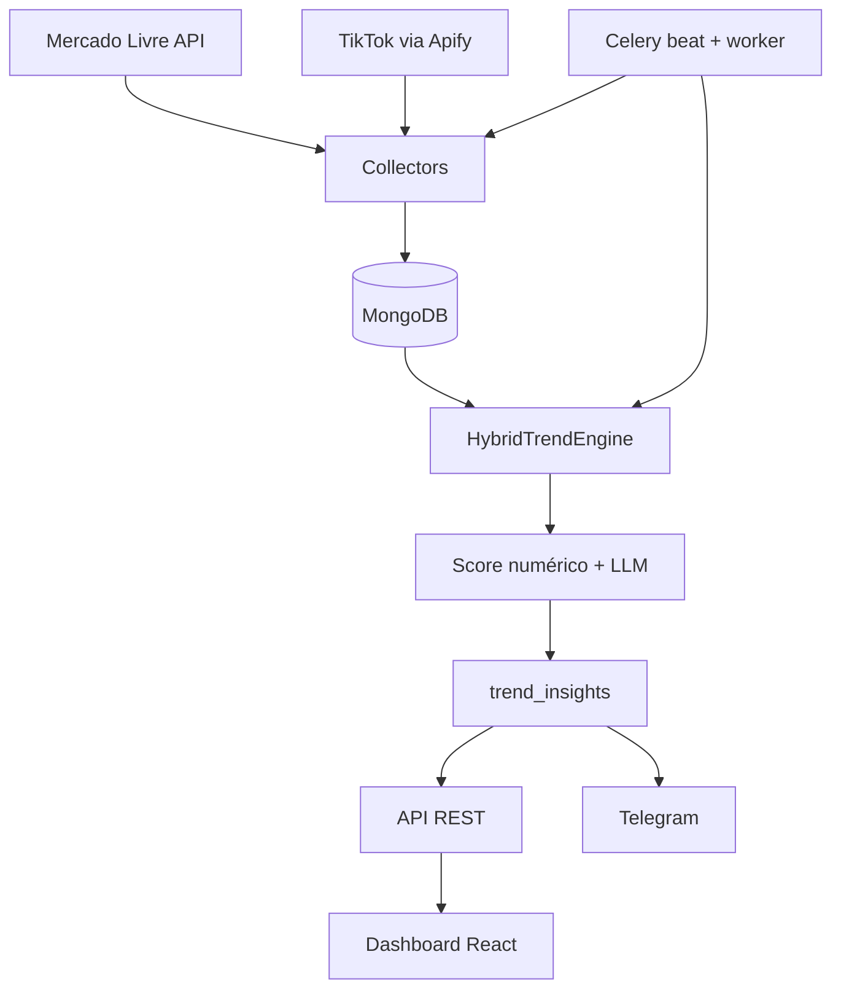

# 🚀 Trends Intelligence Engine

[](https://github.com/wrpaiva/bot-trends/actions/workflows/ci.yml)

> Motor híbrido de detecção de tendências: coleta Mercado Livre + TikTok, calcula um score
> matemático + LLM, expõe rankings via API REST e alerta no Telegram.

> ⚠️ **Estado atual (2026-09):** a API do Mercado Livre passou a exigir OAuth. O projeto já
> autentica (TIE-41), mas **a coleta do ML só funciona depois de criar o app no ML e autorizar
> uma vez** (ver "Autorizando o Mercado Livre"). A coleta do TikTok, a análise, a API, o
> dashboard e os alertas funcionam.

---

## 🏗️ Arquitetura


```mermaid
graph TB
    A[Mercado Livre API] --> C[Collectors]
    B[TikTok via Apify] --> C
    C --> D[(MongoDB)]
    D --> E[HybridTrendEngine]
    E --> F[Score numérico + LLM]
    F --> G[trend_insights]
    G --> H[API REST]
    H --> K[Dashboard React]
    G --> I[Telegram]
    J[Celery beat + worker] --> C
    J --> E
```

| Serviço (compose) | O que faz |
|---|---|
| `mongo` | Persistência (produtos, métricas, insights, categorias, estado dos alertas) |
| `redis` | Broker do Celery e contador do rate limit da API |
| `api` | FastAPI — rankings, busca, categorias (porta `API_HOST_PORT`, default 8000) |
| `worker` | Celery — consome as filas `celery`, `ml`, `tiktok` e `trend` |
| `beat` | Celery beat — agenda coleta e análise |
| `web` | Dashboard React servido por nginx (porta `WEB_HOST_PORT`, default 80) |
| `web-dev` | Dashboard em hot-reload, só com `--profile dev` (porta `WEB_DEV_HOST_PORT`, default 5173) |

### 📁 Estrutura

```
bot-trends/
├── backend/                 # Python 3.11 · FastAPI · Celery · MongoDB · Poetry
│   ├── apps/                # Entrypoints
│   │   ├── api/             # main.py (app, middlewares) · routes.py (endpoints)
│   │   ├── worker/          # main.py (Celery + beat) · tasks.py (coleta) · tasks_trend.py (análise)
│   │   ├── migrate/         # Runner de migrações
│   │   └── bootstrap/       # Seed de categorias
│   └── src/                 # Core (Clean Architecture)
│       ├── domain/          # Entidades e regras puras (score, alertas) — sem I/O
│       ├── application/     # Casos de uso (HybridTrendEngine, prompt)
│       ├── infrastructure/  # Mongo, LLM, collectors, Telegram, config, segurança
│       └── tests/           # pytest
├── frontend/                # React 18 · Vite 5 · chart.js
├── docker-compose.yml
├── .env.example             # → .env da raiz (compose)
└── backend/.env.example     # → backend/.env (aplicação)
```

---

## 🚀 Subindo do zero

### 1️⃣ Os dois arquivos `.env`

São **dois** arquivos, com papéis diferentes:

| Arquivo | Lido por | Contém |
|---|---|---|
| `.env` (raiz) | `docker-compose.yml` | senhas do Mongo/Redis, `API_KEY`, `CORS_ORIGINS`, portas do host |
| `backend/.env` | serviços `api`, `worker`, `beat` | credenciais da aplicação: `LLM_*`, `APIFY_*`, `TIKTOK_*`, `TELEGRAM_*`, `ALERT_*`, `ML_*` |

```bash
cp .env.example .env
cp backend/.env.example backend/.env
openssl rand -hex 32        # use como API_KEY no .env da raiz
```

O compose **sobrescreve** `MONGO_URI`, `REDIS_URL`, `API_KEY` e `CORS_ORIGINS` do `backend/.env`
com valores montados a partir do `.env` da raiz. Sem `API_KEY` o compose se recusa a subir.

Variáveis que você provavelmente vai querer mexer:

| Variável | Arquivo | Para quê |
|---|---|---|
| `API_KEY` | raiz | Chave exigida no header `X-API-Key`. O nginx do dashboard a injeta no proxy `/api` em runtime — **não** vai para o bundle (TIE-27) |
| `CORS_ORIGINS` | raiz | Vazio por padrão: o dashboard usa a mesma origem. Só liste uma origem de browser que chame a API **direto** (na porta 80, `http://localhost`, **sem** `:80`) |
| `LLM_BASE_URL`, `LLM_API_KEY`, `LLM_MODEL` | backend | Qualquer gateway compatível com a API da OpenAI. Sem eles a análise usa só o score numérico |
| `APIFY_TOKEN`, `TIKTOK_HASHTAGS` | backend | Coleta do TikTok. **Custa crédito**: ~US$ 0,0037 por vídeo |
| `TIKTOK_RESULTS_PER_HASHTAG`, `TIKTOK_INTERVAL_MIN` | backend | Volume da coleta (default: 10 vídeos por hashtag a cada 120 min) |
| `TELEGRAM_BOT_TOKEN`, `TELEGRAM_CHAT_ID` | backend | Alertas. Sem eles a análise roda, só não alerta |
| `ALERT_THRESHOLD`, `ALERT_COOLDOWN_HOURS` | backend | Score mínimo para alertar e intervalo entre alertas do mesmo produto |

A lista completa, com defaults, está em `backend/src/infrastructure/config.py`.

### 2️⃣ Subir

```bash
docker compose build && docker compose up -d     # produção
docker compose --profile dev up                  # + dashboard em hot-reload
```

Para atualizar, também `build` e depois `up -d`, não `up -d --build`: no Compose 2.37.1 (o do
Ubuntu 24.04), o `up -d --build` constrói a imagem nova e **deixa o container antigo rodando**
(visto em 2026-10-08). Na dúvida, compare `docker inspect -f '{{.Image}}' trends_api` com
`docker image inspect -f '{{.Id}}' bot-trends-api`.

Portas ocupadas por outro projeto? Troque `API_HOST_PORT`, `WEB_HOST_PORT`, `MONGO_HOST_PORT`,
`REDIS_HOST_PORT` e `WEB_DEV_HOST_PORT` no `.env` da raiz. Mongo e Redis só escutam em `127.0.0.1`.

### 3️⃣ Migrações, categorias e backfill (nesta ordem)

```bash
docker compose run --rm api python -m apps.migrate.main      # índices e collections
docker compose run --rm api python -m apps.bootstrap.main    # categorias padrão
# Uma vez, se já havia vídeos coletados: data de publicação a partir dos datasets
# antigos da Apify (só leitura, não gasta crédito). Sem ela, eles ficam no cálculo antigo.
docker compose run --rm api python -m apps.backfill.tiktok_published --dry-run
docker compose run --rm api python -m apps.backfill.tiktok_published
```

**Autorizando o Mercado Livre.** A API do ML não é mais pública e só aceita OAuth com
autorização do usuário (não há client credentials). Uma vez:

1. Crie um app em [developers.mercadolivre.com.br](https://developers.mercadolivre.com.br/)
   com o escopo `offline_access` e cadastre uma redirect URI `https` (pode ser uma que nem
   carrega, ex.: `https://localhost/ml/callback`).
2. Preencha `ML_CLIENT_ID`, `ML_CLIENT_SECRET` e `ML_REDIRECT_URI` (idêntica à do app) no
   `backend/.env`.
3. Rode a autorização, abra a URL impressa, autorize e cole de volta a URL da barra de endereço:

```bash
docker compose run --rm -it api python -m apps.ml_auth.main    # --sem-pkce se o app não usar PKCE
docker compose run --rm api python -m apps.ml_auth.main --status
```

O par de tokens fica no Mongo (`ml_oauth`) e o worker o renova sozinho (o access token dura
6 h; o refresh token é de uso único e é regravado a cada renovação). Sem credenciais,
`collect_ml` devolve `status: error` com o motivo em `reason`; se o ML recusar o refresh token
(`invalid_grant`), a mensagem pede para rodar a autorização de novo.

O bootstrap é idempotente: rodar de novo atualiza nomes, mas não desabilita o que você
habilitou nem duplica categorias. Para buscar a árvore real do ML (exige a autorização acima):
`docker compose run --rm -e BOOTSTRAP_FETCH_ML_CATEGORIES=true api python -m apps.bootstrap.main`
(com `-e`: a variável no shell do host não chega ao container, e o bootstrap cairia no seed default).

**Escolhendo o que coletar.** Toda categoria nasce desabilitada — enquanto nada for habilitado,
`collect_ml` devolve `{"status": "no enabled categories"}`. Cada categoria habilitada custa
requisições a cada ciclo; comece com poucas, alinhadas ao nicho que você acompanha:

```bash
curl -H "X-API-Key: $API_KEY" "http://localhost:8000/categories?query=celular"
curl -X POST -H "X-API-Key: $API_KEY" -H "Content-Type: application/json" \
  -d '["MLB1051", "MLB1000"]' http://localhost:8000/categories/enable
```

### 4️⃣ Conferir

```bash
curl http://localhost:8000/health                                   # {"status": "ok"}
curl http://localhost:8000/health/ready                             # mongo, redis e migrações
curl -H "X-API-Key: $API_KEY" http://localhost:8000/health/migrations
docker compose ps
```

No `docker compose ps`: a `api` fica `healthy` quando `/health/ready` não dá 503; o `worker`
responde a `celery inspect ping`; o `beat` não tem healthcheck (não serve HTTP nem ping).

O Docker Compose **não reinicia** container `unhealthy` — só o que termina. Por isso o
healthcheck da `api` (`apps/healthcheck/main.py`, TIE-38) distingue os dois casos:

| Falha | O que acontece |
|---|---|
| Readiness (`/health/ready` 503 — Mongo fora) | Só `unhealthy`. Reiniciar a API não conserta o Mongo; em loop, pioraria |
| Liveness (`/health` sem resposta) 3× seguidas (~90 s) | O healthcheck encerra a API (TERM, depois KILL); o container termina e o `restart: unless-stopped` o sobe de novo |

Para isso a `api` roda com `init: true`: dentro do container o PID 1 ignora SIGKILL vindo de
dentro, então a API tem de ser filha do init (tini). Nada recebe acesso ao `docker.sock`.

### 5️⃣ Da coleta ao ranking na tela

O beat coleta e analisa sozinho (ver "Agendamento"), mas a primeira coleta do ML só vem 6 h
depois da subida. Para ver o fluxo inteiro na hora, dispare as tasks pelo próprio worker:

```bash
# Coleta do ML nas categorias habilitadas → {'status': 'ok', 'inserted': N, 'errors': 0}
docker compose exec worker python -c "from apps.worker.main import celery_app as a; \
  print(a.send_task('tasks.collect_ml').get(timeout=300))"

# Análise (janela de 72 h, como o beat) → {'status': 'ok', 'processed': N, ...}
docker compose exec worker python -c "from apps.worker.main import celery_app as a; \
  print(a.send_task('tasks.hybrid_trend_analyze').get(timeout=540))"

curl -H "X-API-Key: $API_KEY" "http://localhost:8000/rankings/latest?limit=5"   # count > 0
```

E então o dashboard (`http://localhost`, porta `WEB_HOST_PORT`) mostra o ranking. Validado de ponta
a ponta em 2026-10-08 (TIE-5): `MLB1051` + `MLB1000` habilitadas → 34 leituras, 0 erros → 33
produtos analisados → 33 no ranking e na tela. O que esperar hoje:

- **Só produtos do ML.** A coleta do TikTok depende de crédito na Apify; sem ele, o breaker
  `apify` aparece aberto no `/health/ready`, e vídeos com métricas de mais de 72 h saem da janela.
- **Quase tudo `ESTAVEL`, score final entre 38 e 54, nenhum alerta** (limiar 60; medido com o
  prompt v5 em 2026-10-08). Item do ML ainda não tem vendas nem avaliações (o ML as nega a token
  comum), e o `rank_momentum` só pontua quando o produto sobe no ranking.
- A análise do beat pode coincidir com a manual: o ranking mostra só o insight mais recente de
  cada produto, então não duplica.

---

### 6️⃣ Produção

Em VPS, com HTTPS (renovação automática) e login na frente do dashboard e do `/api`:
**[docs/DEPLOY.md](docs/DEPLOY.md)** — `docker-compose.prod.yml` (só o Caddy publicado no host)
+ `infra/caddy/Caddyfile`.

---

## 🎛️ API

Swagger em `http://localhost:8000/docs`.

### 🔐 Autenticação

Toda rota, exceto `/` e `/health`, exige o header `X-API-Key` com o valor de `API_KEY`.
Sem ele, ou com valor errado, a resposta é `401`.

```bash
export API_KEY=...   # o mesmo do .env da raiz
curl -H "X-API-Key: $API_KEY" "http://localhost:8000/rankings/latest?hours=72&limit=10"
```

Há rate limit global de 100 requisições/min por IP, e 30/min em `/rankings/latest` e `/search`
(os probes `/health*` ficam de fora). O contador fica no Redis; com o Redis fora ele passa para
a memória de cada processo e a readiness mostra `degraded`.

**O dashboard não conhece a chave (TIE-27).** O browser chama `/api/...` na mesma origem do
dashboard; o nginx do container `web` repassa para a API e põe a `X-API-Key`, lida do ambiente do
container na subida (`frontend/nginx/default.conf.template`). Em desenvolvimento, o proxy do Vite
faz o mesmo. O CI faz o build com uma chave-canário e falha se ela aparecer no `dist`.

> **Isso esconde a chave; não autentica quem acessa.** Quem alcança o dashboard usa a API pelo
> proxy — e todo acesso pelo proxy chega à API com o IP do nginx, então o rate limit por IP vira
> um contador só para o dashboard. Para uso local basta. **Antes de expor na internet**, ponha
> controle de acesso (basic auth, SSO, IP allowlist) no proxy com TLS da TIE-34 — basic auth sem
> TLS manda a senha em claro.

### 📍 Endpoints

| Rota | Auth | Descrição |
|---|---|---|
| `GET /` | — | Identificação do serviço |
| `GET /health` | — | Liveness: o processo responde. Não depende de Mongo nem Redis |
| `GET /health/ready` | — | Readiness: `ready`; `degraded` (200) com Redis fora ou migração pendente/falha; `unavailable` (503) com Mongo fora. Usado pelo healthcheck do Docker |
| `GET /health/migrations` | ✅ | Status das últimas migrações: `ok`, `degraded` (alguma falhou) ou `running` |
| `GET /metrics` | ✅ | Métricas no formato Prometheus: requisições e latência da API por rota, idade da última coleta/insight/backup, fallback do LLM, filas e circuitos (ver "Observabilidade") |
| `GET /rankings/latest` | ✅ | Ranking por `final_score`, um item por produto (o insight mais recente). Query: `source` (`all`\|`mercadolivre`\|`tiktok`), `limit` (1–200), `hours` (1–720, recência: gerados nas últimas N horas), `window_hours` (opcional: só insights calculados com essa janela), `cursor`. Paginado por cursor |
| `GET /insights/latest` | ✅ | Insights gerados nas últimas `hours` horas, do mais novo ao mais antigo. Query: `limit`, `hours`, `window_hours` (opcional), `cursor`. Paginado por cursor |
| `GET /search` | ✅ | Busca no título (stemming em português, ignora acento), por relevância, com o último score de cada produto. Query: `q` (2–100 caracteres), `page`, `limit` (1–50) |
| `GET /products/{product_id}/insight/latest` | ✅ | Último insight do produto (404 se não houver) |
| `GET /products/{product_id}/curve` | ✅ | Produto + métricas das últimas `hours` horas, em ordem cronológica |
| `GET /categories` | ✅ | Categorias com `ml_category_id`. Query: `query` (regex no nome), `limit` |
| `POST /categories/enable` | ✅ | Corpo: lista de `ml_category_id`. Habilita para a coleta |
| `POST /categories/disable` | ✅ | Corpo: lista de `ml_category_id`. Desabilita |

**Paginação.** `/rankings/latest` e `/insights/latest` devolvem `has_more` e `next_cursor`; para a
próxima página, repita a chamada com os mesmos filtros e `cursor=<next_cursor>`. O cursor é
opaco — não o monte nem interprete; cursor inválido ou de outra rota dá `400`. `/search` pagina
por `page`.

Datas saem em ISO 8601 com offset explícito (`2026-09-27T12:00:00+00:00`), sempre em UTC.

---

## 🧠 Motor de análise

### Score numérico (0–100)

Seis componentes normalizados para 0–1 (`backend/src/domain/scoring.py`). Os pesos abaixo são
os defaults; calibre por `SCORE_W_*` no `backend/.env` (precisam somar 1.0 — senão o processo
não sobe). Cada insight grava os pesos usados em `score_weights`.

| Componente | Peso | Normalização |
|---|---|---|
| `rank_momentum` | 0,20 | subida no `/highlights` do ML entre a leitura mais antiga e a mais recente da janela, em escala log (20º → 1º = 1; parado, caindo ou sem ranking — TikTok — = 0) |
| `reviews_velocity` | 0,15 | avaliações novas por dia (`/reviews/item` do ML, mais antiga × mais recente da janela); percentil na categoria (ou 0–50/dia). Sem avaliação — TikTok, e o ML desde 2026-10 (`/reviews/item` dá 403 a token comum) — = 0 |
| aceleração (`social_velocity`) | 0,25 | quanto o ritmo entre as 2 últimas leituras supera o ritmo médio de vida; 0 com leitura única ou abaixo de 1.000 views |
| views por hora de vida | 0,15 | percentil na categoria (ou escala log até 100 mil/h no modo absoluto) |
| engajamento por hora de vida | 0,15 | percentil na categoria (ou escala log até 10 mil/h) |
| estabilidade de preço | 0,10 | `1 − price_volatility`; sem preço (TikTok) = 0,5, neutro |

**Tendência é ritmo, não total.** Para vídeos com data de publicação, views e engajamento entram
como **ritmo por hora de vida** (piso de `TREND_MIN_AGE_HOURS`, 6 h, para vídeo de minutos não
explodir a métrica), e vídeo com mais de `TREND_MAX_AGE_DAYS` (30) dias **fica fora da análise** —
não é tendência. Antes o score usava o total acumulado e o topo era um vídeo de 4 anos com 96 mi de
views. Produtos sem data de publicação (Mercado Livre, vídeos antigos sem backfill) seguem no
cálculo por total. Cada insight grava os sinais usados em `signals`.

**Só conteúdo que vende (`TREND_REQUIRE_COMMERCIAL`).** Vídeo do TikTok sem sinal de venda fica
fora da análise: precisa ter produto do TikTok Shop ou, no texto, loja (Shopee, Shein, Amazon,
Mercado Livre...), "link na bio", "comenta QUERO", preço em R$, código de produto, "achadinho",
"comprei". Nos 501 vídeos reais, `hasTikTokShopProduct` sozinho perderia 79 dos 97 vídeos das
hashtags de compra (afiliado da Shopee manda para a bio), e o texto não casou nenhum dos 404
vídeos de `#fyp`. A task devolve `skipped_no_product` e cada insight grava em
`commercial_marker` o que o fez contar como produto. `false` volta a pontuar tudo.

**Normalização (`SCORE_NORMALIZATION`).** Com `percentile` (padrão), views, engajamento,
`social_velocity` e `reviews_velocity` viram o percentil do produto **dentro da própria
categoria** no ciclo de análise — 5 mil views é excepcional para capinha e medíocre para
celular. Categoria com menos de `SCORE_PERCENTILE_MIN_GROUP` (5) produtos usa o pool global do
ciclo; pool global menor que isso volta à normalização `absolute` (as faixas da tabela). Cada
insight grava a base usada em `debug.numeric_components.normalization`.

> `rank_momentum` e `reviews_velocity` são calculados, mas só existem para item do ML — que ainda
> não coleta (TIE-41) —, então hoje 35% do score numérico de um vídeo do TikTok continua zero
> (`reviews_velocity` vira o percentil 0,5 do empate).

### LLM

O LLM classifica em `ESTAVEL`, `SUBINDO`, `VIRALIZANDO`, `PICO_TEMPORARIO` ou `EM_QUEDA`, dá um
score de potencial (0–100) e um risco (`BAIXO`, `MEDIO`, `ALTO`). A resposta é validada: valor
fora do domínio é rejeitado, score fora da faixa é ajustado para 0–100.

**Prompt (`backend/src/application/prompt_builder.py`).** O LLM recebe os sinais do produto
(ritmo, aceleração, idade, nº de leituras, por que conta como produto) e a referência do grupo
(mediana e p90 de cada sinal, mais o percentil do produto) — **nunca o score numérico pronto**:
com ele no prompt, o modelo copiava a nota e o `llm_score` ficava a ±0,4 do numérico. Traz um
exemplo few-shot por classificação e fala com quem decide se aposta no produto, não com quem
postou o vídeo. Cada insight grava a versão do prompt em `prompt_version` (`null` no fallback).

**Item do Mercado Livre (prompt v5, TIE-42).** Produto de marketplace não tem vídeo: o prompt
manda `social` e `referencia` como `null` e, no lugar, a fonte, a posição no ranking de mais
vendidos agora e no início da janela, o `rank_momentum` e o nº de leituras, com exemplos de item
subindo, parado no topo, caindo e em leitura única. Na v4 ele recebia sinais sociais zerados e
respondia "sem tração social" em tudo. Com os produtos reais do ML (2026-10-08):

| | v4 (340 insights) | v5 (50 insights) |
|---|---|---|
| Valores distintos de `llm_score` | 2 (20 ou 40) | 6 (25 a 65) |
| Classificações | só `ESTAVEL` | `ESTAVEL` 48, `SUBINDO` 1, `EM_QUEDA` 1 |
| Análises que citam views/engajamento/tração | quase todas | 0 |

O `SUBINDO` é um carregador que foi de 11º a 7º; o `EM_QUEDA`, um fone que caiu de 13º para 15º.
Produto que está no ranking de duas categorias mistura as posições numa série só (5 de 94 em
2026-10-08): a leitura não diz de qual categoria é.

**Cache.** A análise do LLM é reaproveitada enquanto as métricas de entrada do produto não
mudam, por até `LLM_CACHE_TTL_HOURS` (default 6; `0` desliga), no Redis. O score numérico é
sempre recalculado. Estimativa: sem cache, até 2.400 chamadas/dia (50 produtos × 48 análises);
com cache, cada produto só chama o LLM quando o TikTok traz métricas novas (a cada
`TIKTOK_INTERVAL_MIN`, 120 min → ≤ 12/dia) ou o TTL vence (4/dia se parado) — **teto de ~600/dia,
−75%**. A taxa real sai no log `llm.cache` e no retorno da task (`llm_cache_hits`/`misses`).

### Avaliação do prompt (TIE-26)

`apps.prompt_eval` mede o prompt com dados reais; rode antes e depois de mexer nele.

```bash
# 1) CSV CEGO (sem a resposta do modelo) com os vídeos analisados pelas versões pedidas
docker compose run --rm -v "$PWD/avaliacao:/out" api python -m apps.prompt_eval.main exportar --saida /out/rotulos.csv
# 2) rotule: classificacao_humana (ESTAVEL, SUBINDO, VIRALIZANDO, PICO_TEMPORARIO, EM_QUEDA) e score_humano (0–100)
# 3) concordância de cada versão com você: acerto, kappa de Cohen, Spearman do score (LLM e numérico)
docker compose run --rm -v "$PWD/avaliacao:/out" api python -m apps.prompt_eval.main concordancia --rotulos /out/rotulos.csv
# 4) estabilidade por temperatura (CUSTA chamadas ao LLM; teto em --max-chamadas)
docker compose run --rm api python -m apps.prompt_eval.main estabilidade --temperaturas 0,0.2,0.7 --repeticoes 3
```

**Temperatura e formato revisados (2026-10-05, `gpt-4.1-mini`, prompt v4, 20 vídeos × 3 repetições):**

| Temperatura | Respostas válidas | Desvio do score entre repetições | Classificação igual entre repetições |
|---|---|---|---|
| 0 | 60/60 | ±1,3 | 98% |
| **0,2** (em uso) | 60/60 | ±1,3 | 98% |
| 0,7 | 60/60 | ±2,5 | 98% |

Fica 0,2: tão estável quanto 0, e 0,7 dobra a variação sem ganho. O formato (`json_object` +
schema) não falhou em 180 chamadas. Nem a 0 é determinística (±1,3). A pasta `avaliacao/` está no
`.gitignore`.

### Score final

```
final_score = SCORE_W_NUMERIC × score_numérico + SCORE_W_LLM × score_llm     (default 0.6 / 0.4)
```

Se o LLM falhar, não estiver configurado ou responder fora do formato, o `final_score` é só o
numérico, e a classificação sai do numérico (≥ 60 `SUBINDO`, ≥ 66 `VIRALIZANDO`; cortes
abaixo do teto de ~67,5 de um vídeo do TikTok, que não tem ranking nem reviews — eram 75/85,
inalcançáveis).

### Alertas

Alerta no Telegram quando `final_score ≥ ALERT_THRESHOLD` (default 60). O mesmo produto só
realerta depois de `ALERT_COOLDOWN_HOURS` (default 24) — ou antes, se a classificação subir de
faixa (ex.: `SUBINDO` → `VIRALIZANDO`). Falha no envio não interrompe a análise; o alerta é
tentado de novo no próximo ciclo.

**Por que 60** (calibrado em 2026-10-03): sem `rank_momentum` e `reviews_velocity` (vídeo do
TikTok não tem ranking nem reviews; TIE-16), o numérico não passa de ~67,5 e o final de ~80,5 — o antigo 85 nunca disparava.
Reprocessando com o motor atual as leituras reais do TikTok (24–25/09, 13 ciclos, 55 vídeos
comerciais), o numérico teve p50 39, p90 52, p95 53 e só 4 vídeos passaram de 60. Nos 20
insights com LLM (prompt v4), 60 deixa passar só o único `SUBINDO` (final 64,7): o LLM
derruba os outros dois que tinham numérico acima de 60. Item do ML com subida no ranking pode
ir além do teto de ~67,5: quando o ML coletar (TIE-41), recalibre com os dados dele.

### Backtest (TIE-23)

O score ordena melhor o que vai crescer do que um baseline burro? Em cada instante de coleta T,
`apps.backtest` monta as entradas **como a análise as veria em T** (só leituras até T, mesmo
filtro comercial, corte de idade e percentil), pontua com o motor numérico atual e compara três
ordens — `score`, `views_por_hora` (o baseline) e `views_total` (popularidade) — com o que
aconteceu até a primeira leitura ≥ T + horizonte: views ganhas por hora (`ganho_views_h`) e esse
ritmo ÷ o ritmo de vida (`aceleracao`). Métricas: Spearman e precisão no top-k, média dos cortes.
Só lê o banco.

```bash
docker compose run --rm api python -m apps.backtest.main                       # horizonte 6 h
docker compose run --rm api python -m apps.backtest.main --horizon-hours 3 --json
```

**Resultado em 2026-10-04 — inconclusivo.** As leituras reais cobrem só 24/09 02h → 25/09 06h e a
maioria dos vídeos aparece em uma coleta só: com o pool de produção (50), 5–6 cortes de 5–7
vídeos. Ampliando o pool (`--limit-products 500 --k 3`), Spearman médio contra `ganho_views_h`:

| Horizonte | Cortes | `score` | `views_por_hora` | `views_total` |
|---|---|---|---|---|
| 3 h | 10 | +0,52 | +0,36 | +0,08 |
| 6 h | 5 | +0,51 | +0,51 | +0,14 |

O score empata ou fica levemente à frente do baseline, e os dois batem a popularidade pura — mas
com 5–7 vídeos por corte e cortes que compartilham vídeos, nada disso é significativo. O LLM fica
de fora (não dá para refazer as chamadas do passado). **Rode de novo quando a coleta voltar.**

---

## ⚙️ Agendamento

| Task | Fila | Frequência |
|---|---|---|
| `tasks.collect_ml` | `ml` | a cada 6 h |
| `tasks.collect_tiktok` | `tiktok` | a cada `TIKTOK_INTERVAL_MIN` minutos (default 120) |
| `tasks.hybrid_trend_analyze` | `trend` | a cada 30 min |
| `tasks.system_health_check` | `celery` | a cada 15 min — alerta em `TELEGRAM_SYSTEM_CHAT_ID` se coleta/análise pararem, o LLM cair no fallback demais, a fila acumular ou o backup falhar |

As tasks de coleta devolvem `status` `ok`, `partial` (alguma requisição falhou) ou `error`
(nada coletado por falha), junto com `inserted` e `errors`.

**Circuit breaker.** Mercado Livre, Apify e LLM têm um circuito cada, com estado no Redis.
`BREAKER_FAILURE_THRESHOLD` (5) falhas seguidas abrem o circuito: a coleta devolve
`circuit_open` sem tentar, e o LLM é pulado (score só numérico). Depois de `BREAKER_COOLDOWN_MIN`
(30) minutos, uma tentativa de teste decide se fecha. O estado aparece em `/health/ready`
(`breakers`); circuito aberto deixa a readiness `degraded`.

```bash
docker compose logs -f worker
docker compose exec worker celery -A apps.worker.main.celery_app inspect active

# Análise manual
docker compose run --rm api python -c \
  "from apps.worker.tasks_trend import hybrid_trend_analyze; print(hybrid_trend_analyze(hours=24, limit_products=5))"
```

---

## 📊 Collections

| Collection | Conteúdo | Chave |
|---|---|---|
| `products` | Produto normalizado de cada fonte: `title`, `category`, `brand`, `permalink`, `canonical_id` (reservado para casar o mesmo produto entre fontes) | Dedupe por `source` + `source_product_id` (índice único); `product_id` (UUID) é o id interno usado pelas outras collections |
| `metrics` | Série temporal por produto: `ts`, `source`, `price`, `views`, `engagement`, `mentions` | `product_id` + `ts` |
| `trend_insights` | Resultado de cada análise: `numeric_score`, `llm_score`, `final_score`, `trend_classification`, `risk_level`, `analysis`, `recommendation`, `sources`, janela (`window_from`/`window_to`/`window_hours`) | `product_id` + `ts` |
| `categories` | `key`, `name`, `ml_category_id`, `enabled`, `keywords` | `key` |
| `alert_state` | Último alerta por produto: `alerted_at`, `classification`, `final_score` | `product_id` |
| `migrations`, `migration_lock` | Controle das migrações | — |

Migrações (`backend/src/infrastructure/db/migrations/versions/`) são idempotentes, versionadas e
protegidas por lock distribuído. Não há rollback: correção é sempre uma migração nova.

---

## 📈 Observabilidade (TIE-36)

Três camadas, cada uma para uma pergunta:

| Camada | Responde | Onde |
|---|---|---|
| Logs JSON | O que aconteceu nesta task/requisição? | `docker compose logs`; `task.inicio`/`task.fim`, `http.chamada` (TIE-13) |
| Check de saúde | Tem algo quebrado agora? (ok/problema, com limiar) | Telegram `TELEGRAM_SYSTEM_CHAT_ID`, a cada 15 min (TIE-39) |
| `GET /metrics` + Prometheus/Grafana | Quanto, desde quando, com que tendência? | Formato Prometheus, exige `X-API-Key`; dashboard e regras no profile `observability` |

```bash
curl -H "X-API-Key: $API_KEY" http://localhost:8000/metrics

# Prometheus (:9090) + Grafana (:3000), só em 127.0.0.1; portas em PROMETHEUS_HOST_PORT/GRAFANA_HOST_PORT
docker compose --profile observability up -d prometheus grafana
```

O Grafana abre no dashboard **Trends — visão geral** (coleta, análise e LLM, tasks, API, infra),
com o datasource já provisionado (`infra/observability/grafana/`). Login `admin` com
`GRAFANA_ADMIN_PASSWORD` do `.env` da raiz. O Prometheus avalia
`infra/observability/prometheus/alerts.yml`: coleta do TikTok parada > 4 h, do ML > 12 h, análise
parada > 1 h, LLM no fallback > 50%, componente fora, `/metrics` inacessível. **Sem Alertmanager:**
os alertas aparecem em Prometheus → Alerts e no Grafana; quem avisa no Telegram continua sendo o
check de saúde.

| Métrica | Tipo | O que é |
|---|---|---|
| `trends_http_requests_total{method,route,status}` | counter | Requisições à API. `route` é o template (`/products/{product_id}/curve`); sem rota vira `nao_roteada` |
| `trends_http_request_duration_seconds{method,route}` | histogram | Latência da API |
| `trends_last_collection_age_seconds{source}` | gauge | Desde a última leitura da fonte (ausente = nunca coletou) |
| `trends_last_collection_items{source}` | gauge | Leituras gravadas no último ciclo de coleta |
| `trends_collected_items_total{task}` | counter | Itens gravados pelas tasks de coleta (`inserted`) |
| `trends_task_runs_total{task,state,status}` | counter | Execuções de task (estado do Celery e `status` devolvido) |
| `trends_task_duration_seconds{task}` | histogram | Duração das tasks |
| `trends_llm_calls_total{result}` | counter | Chamadas HTTP reais ao LLM: `ok`, `http_429`, `erro_rede`, `resposta_invalida`... — é o que custa |
| `trends_llm_cache_total{result}` | counter | Cache do LLM: `hit` poupa uma chamada |
| `trends_last_insight_age_seconds` | gauge | Desde o último insight |
| `trends_insights_24h` | gauge | Insights nas últimas 24 h |
| `trends_products{source}` | gauge | Produtos/vídeos conhecidos |
| `trends_llm_fallback_ratio` / `_sample` | gauge | Fração dos insights das últimas 6 h sem LLM, e a amostra |
| `trends_celery_queue_length{queue}` | gauge | Mensagens esperando por fila |
| `trends_circuit_breaker_state{service,state}` / `_failures` | gauge | Estado atual (1) de cada circuito e falhas seguidas |
| `trends_backup_age_seconds` / `_last_ok` / `_size_bytes` | gauge | Último backup registrado |
| `trends_component_up{component}` | gauge | Mongo e Redis responderam no scrape (0 = a parte dele some, o resto sai) |

Os contadores HTTP vivem na memória do processo: zeram a cada restart da API e só valem com um
worker uvicorn (o padrão). As métricas do worker (tasks, itens, LLM) moram no Redis (hash
`obs:metrics`): somam os processos do Celery e sobrevivem a restart. Gravar métrica nunca derruba
task — com o Redis fora, a métrica se perde e a task segue.

---

## 💾 Backup e restauração

O serviço `backup` do compose roda `infra/backup/backup.sh` a cada `BACKUP_INTERVAL_HOURS` (24):
`mongodump` comprimido em `BACKUP_HOST_DIR` (default `./backups`, fora do git), com um
`.counts.json` ao lado (documentos por collection, lido da saída do próprio dump). Retenção de
`BACKUP_RETENTION_DAYS` (14) dias, sempre mantendo os `BACKUP_KEEP_MIN` (3) mais recentes. Cada
execução grava o resultado em `trends.backups`; se falhar ou ficar velho, o check de saúde alerta.

**Fora da máquina** — o dump local não protege contra perder o disco. Escolha um:
- aponte `BACKUP_HOST_DIR` para um disco externo ou NAS montado; ou
- `BACKUP_UPLOAD_CMD` com `{}` no lugar do arquivo, ex.: `rclone copy {} remoto:trends-backups`
  (instale o `rclone` numa imagem própria; a `mongo:7` não o traz).

**Testar a restauração** (faça isso de vez em quando — backup não testado não é backup). Sobe um
Mongo descartável, restaura e confere as contagens com o gabarito:

```bash
docker network create restore_test
docker run -d --rm --name mongo_descartavel --network restore_test mongo:7
docker run --rm --network restore_test -e RESTORE_URI=mongodb://mongo_descartavel:27017 \
  -v $PWD/infra/backup:/backup:ro -v $PWD/backups:/backups mongo:7 \
  bash /backup/restore_test.sh /backups/trends-<data>.archive.gz
docker stop mongo_descartavel && docker network rm restore_test
```

**Restaurar em produção** (destrutivo — pare `worker` e `beat` antes):
`mongorestore --uri="$MONGO_URI" --archive=<arquivo> --gzip --drop --nsInclude="trends.*"`.

---

## 🧪 Desenvolvimento

Detalhes em [`backend/README.md`](backend/README.md) e [`frontend/README.md`](frontend/README.md).
Instruções para agentes e armadilhas conhecidas: [`CLAUDE.md`](CLAUDE.md).

O CI (`.github/workflows/ci.yml`) roda testes com cobertura mínima, ruff, black, build do
frontend e build das imagens Docker.
