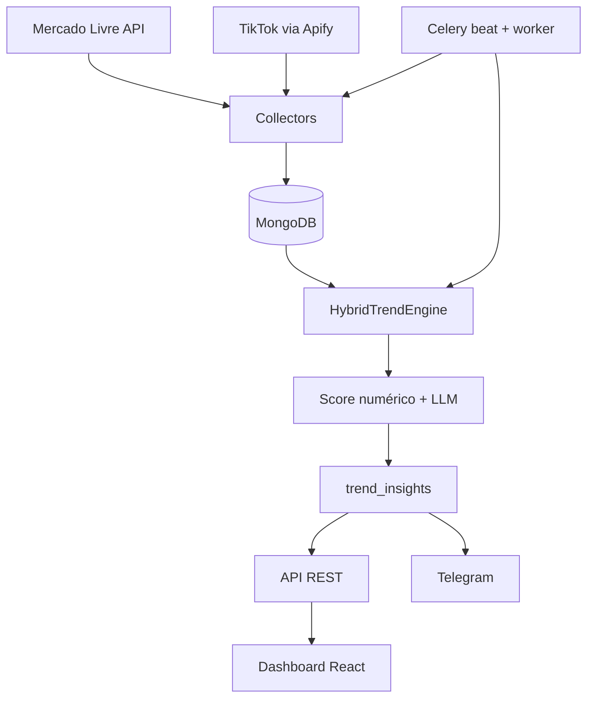

# 🚀 Trends Intelligence Engine

[](https://github.com/wrpaiva/bot-trends/actions/workflows/ci.yml)

> Motor híbrido de detecção de tendências: coleta Mercado Livre + TikTok, calcula um score
> matemático + LLM, expõe rankings via API REST e alerta no Telegram.

> ⚠️ **Estado atual (2026-09):** a API do Mercado Livre passou a exigir OAuth e o projeto ainda
> não autentica (TIE-41) — **a coleta do ML não funciona hoje**. A coleta do TikTok, a análise,
> a API, o dashboard e os alertas funcionam.

---

## 🏗️ Arquitetura


```mermaid
graph TB
    A[Mercado Livre API] --> C[Collectors]
    B[TikTok via Apify] --> C
    C --> D[(MongoDB)]
    D --> E[HybridTrendEngine]
    E --> F[Score numérico + LLM]
    F --> G[trend_insights]
    G --> H[API REST]
    H --> K[Dashboard React]
    G --> I[Telegram]
    J[Celery beat + worker] --> C
    J --> E
```

| Serviço (compose) | O que faz |
|---|---|
| `mongo` | Persistência (produtos, métricas, insights, categorias, estado dos alertas) |
| `redis` | Broker do Celery e contador do rate limit da API |
| `api` | FastAPI — rankings, busca, categorias (porta `API_HOST_PORT`, default 8000) |
| `worker` | Celery — consome as filas `celery`, `ml`, `tiktok` e `trend` |
| `beat` | Celery beat — agenda coleta e análise |
| `web` | Dashboard React servido por nginx (porta `WEB_HOST_PORT`, default 80) |
| `web-dev` | Dashboard em hot-reload, só com `--profile dev` (porta `WEB_DEV_HOST_PORT`, default 5173) |

### 📁 Estrutura

```
bot-trends/
├── backend/                 # Python 3.11 · FastAPI · Celery · MongoDB · Poetry
│   ├── apps/                # Entrypoints
│   │   ├── api/             # main.py (app, middlewares) · routes.py (endpoints)
│   │   ├── worker/          # main.py (Celery + beat) · tasks.py (coleta) · tasks_trend.py (análise)
│   │   ├── migrate/         # Runner de migrações
│   │   └── bootstrap/       # Seed de categorias
│   └── src/                 # Core (Clean Architecture)
│       ├── domain/          # Entidades e regras puras (score, alertas) — sem I/O
│       ├── application/     # Casos de uso (HybridTrendEngine, prompt)
│       ├── infrastructure/  # Mongo, LLM, collectors, Telegram, config, segurança
│       └── tests/           # pytest
├── frontend/                # React 18 · Vite 5 · chart.js
├── docker-compose.yml
├── .env.example             # → .env da raiz (compose)
└── backend/.env.example     # → backend/.env (aplicação)
```

---

## 🚀 Subindo do zero

### 1️⃣ Os dois arquivos `.env`

São **dois** arquivos, com papéis diferentes:

| Arquivo | Lido por | Contém |
|---|---|---|
| `.env` (raiz) | `docker-compose.yml` | senhas do Mongo/Redis, `API_KEY`, `CORS_ORIGINS`, `VITE_API_BASE`, portas do host |
| `backend/.env` | serviços `api`, `worker`, `beat` | credenciais da aplicação: `LLM_*`, `APIFY_*`, `TIKTOK_*`, `TELEGRAM_*`, `ALERT_*`, `ML_*` |

```bash
cp .env.example .env
cp backend/.env.example backend/.env
openssl rand -hex 32        # use como API_KEY no .env da raiz
```

O compose **sobrescreve** `MONGO_URI`, `REDIS_URL`, `API_KEY` e `CORS_ORIGINS` do `backend/.env`
com valores montados a partir do `.env` da raiz. Sem `API_KEY` o compose se recusa a subir.

Variáveis que você provavelmente vai querer mexer:

| Variável | Arquivo | Para quê |
|---|---|---|
| `API_KEY` | raiz | Chave exigida no header `X-API-Key`; também é embutida no build do dashboard |
| `CORS_ORIGINS` | raiz | Origens do dashboard, separadas por vírgula. Na porta 80 use `http://localhost`, **sem** `:80` |
| `VITE_API_BASE` | raiz | URL da API vista pelo browser; é embutida no build — mudou, rode `docker compose build web` |
| `LLM_BASE_URL`, `LLM_API_KEY`, `LLM_MODEL` | backend | Qualquer gateway compatível com a API da OpenAI. Sem eles a análise usa só o score numérico |
| `APIFY_TOKEN`, `TIKTOK_HASHTAGS` | backend | Coleta do TikTok. **Custa crédito**: ~US$ 0,0037 por vídeo |
| `TIKTOK_RESULTS_PER_HASHTAG`, `TIKTOK_INTERVAL_MIN` | backend | Volume da coleta (default: 10 vídeos por hashtag a cada 120 min) |
| `TELEGRAM_BOT_TOKEN`, `TELEGRAM_CHAT_ID` | backend | Alertas. Sem eles a análise roda, só não alerta |
| `ALERT_THRESHOLD`, `ALERT_COOLDOWN_HOURS` | backend | Score mínimo para alertar e intervalo entre alertas do mesmo produto |

A lista completa, com defaults, está em `backend/src/infrastructure/config.py`.

### 2️⃣ Subir

```bash
docker compose up -d --build              # produção
docker compose --profile dev up           # + dashboard em hot-reload
```

Portas ocupadas por outro projeto? Troque `API_HOST_PORT`, `WEB_HOST_PORT`, `MONGO_HOST_PORT`,
`REDIS_HOST_PORT` e `WEB_DEV_HOST_PORT` no `.env` da raiz. Mongo e Redis só escutam em `127.0.0.1`.

### 3️⃣ Migrações e categorias (nesta ordem)

```bash
docker compose run --rm api python -m apps.migrate.main      # índices e collections
docker compose run --rm api python -m apps.bootstrap.main    # categorias padrão
```

O bootstrap é idempotente: rodar de novo atualiza nomes, mas não desabilita o que você
habilitou nem duplica categorias. Para buscar a árvore real do ML (exige o token da TIE-41):
`BOOTSTRAP_FETCH_ML_CATEGORIES=true docker compose run --rm api python -m apps.bootstrap.main`.

**Escolhendo o que coletar.** Toda categoria nasce desabilitada — enquanto nada for habilitado,
`collect_ml` devolve `{"status": "no enabled categories"}`. Cada categoria habilitada custa
requisições a cada ciclo; comece com poucas, alinhadas ao nicho que você acompanha:

```bash
curl -H "X-API-Key: $API_KEY" "http://localhost:8000/categories?query=celular"
curl -X POST -H "X-API-Key: $API_KEY" -H "Content-Type: application/json" \
  -d '["MLB1051", "MLB1000"]' http://localhost:8000/categories/enable
```

### 4️⃣ Conferir

```bash
curl http://localhost:8000/health                                   # {"status": "ok"}
curl http://localhost:8000/health/ready                             # mongo, redis e migrações
curl -H "X-API-Key: $API_KEY" http://localhost:8000/health/migrations
docker compose ps
```

No `docker compose ps`: a `api` fica `healthy` quando `/health/ready` não dá 503; o `worker`
responde a `celery inspect ping`; o `beat` não tem healthcheck (não serve HTTP nem ping).
Docker Compose **não reinicia** container `unhealthy` sozinho — só o que termina.

---

## 🎛️ API

Swagger em `http://localhost:8000/docs`.

### 🔐 Autenticação

Toda rota, exceto `/` e `/health`, exige o header `X-API-Key` com o valor de `API_KEY`.
Sem ele, ou com valor errado, a resposta é `401`.

```bash
export API_KEY=...   # o mesmo do .env da raiz
curl -H "X-API-Key: $API_KEY" "http://localhost:8000/rankings/latest?hours=72&limit=10"
```

Há rate limit global de 100 requisições/min por IP, e 30/min em `/rankings/latest` e `/search`
(os probes `/health*` ficam de fora). O contador fica no Redis; com o Redis fora ele passa para
a memória de cada processo e a readiness mostra `degraded`.

### 📍 Endpoints

| Rota | Auth | Descrição |
|---|---|---|
| `GET /` | — | Identificação do serviço |
| `GET /health` | — | Liveness: o processo responde. Não depende de Mongo nem Redis |
| `GET /health/ready` | — | Readiness: `ready`; `degraded` (200) com Redis fora ou migração pendente/falha; `unavailable` (503) com Mongo fora. Usado pelo healthcheck do Docker |
| `GET /health/migrations` | ✅ | Status das últimas migrações: `ok`, `degraded` (alguma falhou) ou `running` |
| `GET /rankings/latest` | ✅ | Ranking por `final_score`, um item por produto (o insight mais recente). Query: `source` (`all`\|`mercadolivre`\|`tiktok`), `limit` (1–200), `hours` (1–720, recência: gerados nas últimas N horas), `window_hours` (opcional: só insights calculados com essa janela), `cursor`. Paginado por cursor |
| `GET /insights/latest` | ✅ | Insights gerados nas últimas `hours` horas, do mais novo ao mais antigo. Query: `limit`, `hours`, `window_hours` (opcional), `cursor`. Paginado por cursor |
| `GET /search` | ✅ | Busca no título (stemming em português, ignora acento), por relevância, com o último score de cada produto. Query: `q` (2–100 caracteres), `page`, `limit` (1–50) |
| `GET /products/{product_id}/insight/latest` | ✅ | Último insight do produto (404 se não houver) |
| `GET /products/{product_id}/curve` | ✅ | Produto + métricas das últimas `hours` horas, em ordem cronológica |
| `GET /categories` | ✅ | Categorias com `ml_category_id`. Query: `query` (regex no nome), `limit` |
| `POST /categories/enable` | ✅ | Corpo: lista de `ml_category_id`. Habilita para a coleta |
| `POST /categories/disable` | ✅ | Corpo: lista de `ml_category_id`. Desabilita |

**Paginação.** `/rankings/latest` e `/insights/latest` devolvem `has_more` e `next_cursor`; para a
próxima página, repita a chamada com os mesmos filtros e `cursor=<next_cursor>`. O cursor é
opaco — não o monte nem interprete; cursor inválido ou de outra rota dá `400`. `/search` pagina
por `page`.

Datas saem em ISO 8601 com offset explícito (`2026-09-27T12:00:00+00:00`), sempre em UTC.

---

## 🧠 Motor de análise

### Score numérico (0–100)

Seis componentes normalizados para 0–1 (`backend/src/domain/scoring.py`). Os pesos abaixo são
os defaults; calibre por `SCORE_W_*` no `backend/.env` (precisam somar 1.0 — senão o processo
não sobe). Cada insight grava os pesos usados em `score_weights`.

| Componente | Peso | Normalização |
|---|---|---|
| `rank_momentum` | 0,20 | já vem em 0–1 |
| `reviews_velocity` | 0,15 | percentil na categoria (ou 0–50 reviews) |
| `social_velocity` | 0,25 | percentil na categoria (ou 0–100% de crescimento) |
| `views_24h` | 0,15 | percentil na categoria (ou 0–300 mil no modo absoluto) |
| `engagement_24h` | 0,15 | percentil na categoria (ou 0–20 mil no modo absoluto) |
| estabilidade de preço | 0,10 | `1 − price_volatility` |

**Normalização (`SCORE_NORMALIZATION`).** Com `percentile` (padrão), views, engajamento,
`social_velocity` e `reviews_velocity` viram o percentil do produto **dentro da própria
categoria** no ciclo de análise — 5 mil views é excepcional para capinha e medíocre para
celular. Categoria com menos de `SCORE_PERCENTILE_MIN_GROUP` (5) produtos usa o pool global do
ciclo; pool global menor que isso volta à normalização `absolute` (as faixas da tabela). Cada
insight grava a base usada em `debug.numeric_components.normalization`.

> `rank_momentum` e `reviews_velocity` ainda são fixos em `0.0` (dependem da coleta do ML,
> TIE-16) — hoje 35% do score numérico é sempre zero.

### LLM

O LLM classifica em `ESTAVEL`, `SUBINDO`, `VIRALIZANDO`, `PICO_TEMPORARIO` ou `EM_QUEDA`, dá um
score de potencial (0–100) e um risco (`BAIXO`, `MEDIO`, `ALTO`). A resposta é validada: valor
fora do domínio é rejeitado, score fora da faixa é ajustado para 0–100.

**Cache.** A análise do LLM é reaproveitada enquanto as métricas de entrada do produto não
mudam, por até `LLM_CACHE_TTL_HOURS` (default 6; `0` desliga), no Redis. O score numérico é
sempre recalculado. Estimativa: sem cache, até 2.400 chamadas/dia (50 produtos × 48 análises);
com cache, cada produto só chama o LLM quando o TikTok traz métricas novas (a cada
`TIKTOK_INTERVAL_MIN`, 120 min → ≤ 12/dia) ou o TTL vence (4/dia se parado) — **teto de ~600/dia,
−75%**. A taxa real sai no log `llm.cache` e no retorno da task (`llm_cache_hits`/`misses`).

### Score final

```
final_score = SCORE_W_NUMERIC × score_numérico + SCORE_W_LLM × score_llm     (default 0.6 / 0.4)
```

Se o LLM falhar, não estiver configurado ou responder fora do formato, o `final_score` é só o
numérico, e a classificação sai do numérico (≥ 75 `SUBINDO`, ≥ 85 `VIRALIZANDO`).

### Alertas

Alerta no Telegram quando `final_score ≥ ALERT_THRESHOLD` (default 85). O mesmo produto só
realerta depois de `ALERT_COOLDOWN_HOURS` (default 24) — ou antes, se a classificação subir de
faixa (ex.: `SUBINDO` → `VIRALIZANDO`). Falha no envio não interrompe a análise; o alerta é
tentado de novo no próximo ciclo.

---

## ⚙️ Agendamento

| Task | Fila | Frequência |
|---|---|---|
| `tasks.collect_ml` | `ml` | a cada 6 h |
| `tasks.collect_tiktok` | `tiktok` | a cada `TIKTOK_INTERVAL_MIN` minutos (default 120) |
| `tasks.hybrid_trend_analyze` | `trend` | a cada 30 min |
| `tasks.system_health_check` | `celery` | a cada 15 min — alerta em `TELEGRAM_SYSTEM_CHAT_ID` se coleta/análise pararem, o LLM cair no fallback demais, a fila acumular ou o backup falhar |

As tasks de coleta devolvem `status` `ok`, `partial` (alguma requisição falhou) ou `error`
(nada coletado por falha), junto com `inserted` e `errors`.

**Circuit breaker.** Mercado Livre, Apify e LLM têm um circuito cada, com estado no Redis.
`BREAKER_FAILURE_THRESHOLD` (5) falhas seguidas abrem o circuito: a coleta devolve
`circuit_open` sem tentar, e o LLM é pulado (score só numérico). Depois de `BREAKER_COOLDOWN_MIN`
(30) minutos, uma tentativa de teste decide se fecha. O estado aparece em `/health/ready`
(`breakers`); circuito aberto deixa a readiness `degraded`.

```bash
docker compose logs -f worker
docker compose exec worker celery -A apps.worker.main.celery_app inspect active

# Análise manual
docker compose run --rm api python -c \
  "from apps.worker.tasks_trend import hybrid_trend_analyze; print(hybrid_trend_analyze(hours=24, limit_products=5))"
```

---

## 📊 Collections

| Collection | Conteúdo | Chave |
|---|---|---|
| `products` | Produto normalizado de cada fonte: `title`, `category`, `brand`, `permalink`, `canonical_id` (reservado para casar o mesmo produto entre fontes) | Dedupe por `source` + `source_product_id` (índice único); `product_id` (UUID) é o id interno usado pelas outras collections |
| `metrics` | Série temporal por produto: `ts`, `source`, `price`, `views`, `engagement`, `mentions` | `product_id` + `ts` |
| `trend_insights` | Resultado de cada análise: `numeric_score`, `llm_score`, `final_score`, `trend_classification`, `risk_level`, `analysis`, `recommendation`, `sources`, janela (`window_from`/`window_to`/`window_hours`) | `product_id` + `ts` |
| `categories` | `key`, `name`, `ml_category_id`, `enabled`, `keywords` | `key` |
| `alert_state` | Último alerta por produto: `alerted_at`, `classification`, `final_score` | `product_id` |
| `migrations`, `migration_lock` | Controle das migrações | — |

Migrações (`backend/src/infrastructure/db/migrations/versions/`) são idempotentes, versionadas e
protegidas por lock distribuído. Não há rollback: correção é sempre uma migração nova.

---

## 💾 Backup e restauração

O serviço `backup` do compose roda `infra/backup/backup.sh` a cada `BACKUP_INTERVAL_HOURS` (24):
`mongodump` comprimido em `BACKUP_HOST_DIR` (default `./backups`, fora do git), com um
`.counts.json` ao lado (documentos por collection, lido da saída do próprio dump). Retenção de
`BACKUP_RETENTION_DAYS` (14) dias, sempre mantendo os `BACKUP_KEEP_MIN` (3) mais recentes. Cada
execução grava o resultado em `trends.backups`; se falhar ou ficar velho, o check de saúde alerta.

**Fora da máquina** — o dump local não protege contra perder o disco. Escolha um:
- aponte `BACKUP_HOST_DIR` para um disco externo ou NAS montado; ou
- `BACKUP_UPLOAD_CMD` com `{}` no lugar do arquivo, ex.: `rclone copy {} remoto:trends-backups`
  (instale o `rclone` numa imagem própria; a `mongo:7` não o traz).

**Testar a restauração** (faça isso de vez em quando — backup não testado não é backup). Sobe um
Mongo descartável, restaura e confere as contagens com o gabarito:

```bash
docker network create restore_test
docker run -d --rm --name mongo_descartavel --network restore_test mongo:7
docker run --rm --network restore_test -e RESTORE_URI=mongodb://mongo_descartavel:27017 \
  -v $PWD/infra/backup:/backup:ro -v $PWD/backups:/backups mongo:7 \
  bash /backup/restore_test.sh /backups/trends-<data>.archive.gz
docker stop mongo_descartavel && docker network rm restore_test
```

**Restaurar em produção** (destrutivo — pare `worker` e `beat` antes):
`mongorestore --uri="$MONGO_URI" --archive=<arquivo> --gzip --drop --nsInclude="trends.*"`.

---

## 🧪 Desenvolvimento

Detalhes em [`backend/README.md`](backend/README.md) e [`frontend/README.md`](frontend/README.md).
Instruções para agentes e armadilhas conhecidas: [`CLAUDE.md`](CLAUDE.md).

O CI (`.github/workflows/ci.yml`) roda testes com cobertura mínima, ruff, black, build do
frontend e build das imagens Docker.
